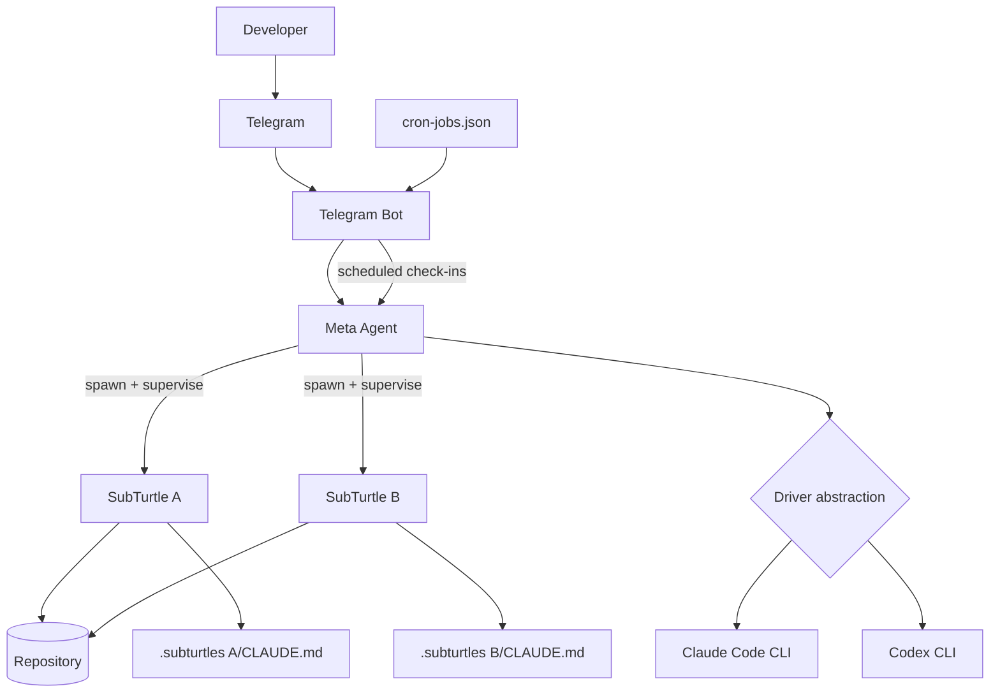

# Architecture

Super Turtle is a local multi-agent system controlled from Telegram. A single Meta Agent handles conversation, planning, and supervision. It can spawn SubTurtles to execute work in parallel and route loops through Claude Code or Codex.

## System Diagram



## Meta Agent

The Meta Agent is the single interface you talk to. It:

- Interprets requests from Telegram.
- Decomposes larger tasks into parallelizable units.
- Seeds SubTurtle state files and starts workers with `./super_turtle/subturtle/ctl spawn`.
- Monitors progress through scheduled supervision prompts.
- Sends milestone-only updates instead of noisy step-by-step logs.

The user experience stays simple: one conversation, multiple workers behind the scenes.

## SubTurtle Loop Types

Each SubTurtle runs one autonomous loop:

| Type | What it does | Typical use |
|------|---------------|-------------|
| `slow` | Plan -> Groom -> Execute -> Review | Complex multi-step work |
| `yolo` | Single Claude call per iteration | Fast Claude-centric execution |
| `yolo-codex` | Single Codex call per iteration | Default low-cost worker mode |
| `yolo-codex-spark` | Single Codex Spark call per iteration | Fastest Codex-based loops |

See [SubTurtle Loop Types](/subturtles/loop-types) for details.

## State Management

State is markdown-first and lives in `CLAUDE.md` files:

- Project-level state in the repo root.
- Per-worker state in `.subturtles/<name>/CLAUDE.md`.

The backlog in each file is the execution contract for that run. A SubTurtle exits when it appends:

```md
## Loop Control
STOP
```

This keeps handoff and supervision human-readable while still machine-checkable.

## Cron Supervision

`ctl spawn` automatically registers recurring supervision jobs in `super_turtle/claude-telegram-bot/cron-jobs.json`.

- Jobs are marked `silent: true` by default for low-noise operation.
- Check-ins focus on milestone detection and stuck/error states.
- Interval is configurable (`--cron-interval` on spawn, `ctl reschedule-cron` later).

The default spawn interval is 10 minutes, and it can be tightened or relaxed as workload changes.

## Driver Abstraction

Super Turtle routes execution through a driver layer so workers can use either runtime without changing task-level instructions:

- Claude Code: strongest reasoning and high-complexity workflows.
- Codex: lower-cost, faster loops for straightforward implementation.

`yolo-codex` is the default SubTurtle type, while the Meta Agent can switch drivers based on task complexity and quota signals.

## What's Next

- Learn [SubTurtle commands](/subturtles/ctl-commands).
- Review [Meta supervision](/meta/supervision).
- Read [Drivers and models](/bot/drivers).
