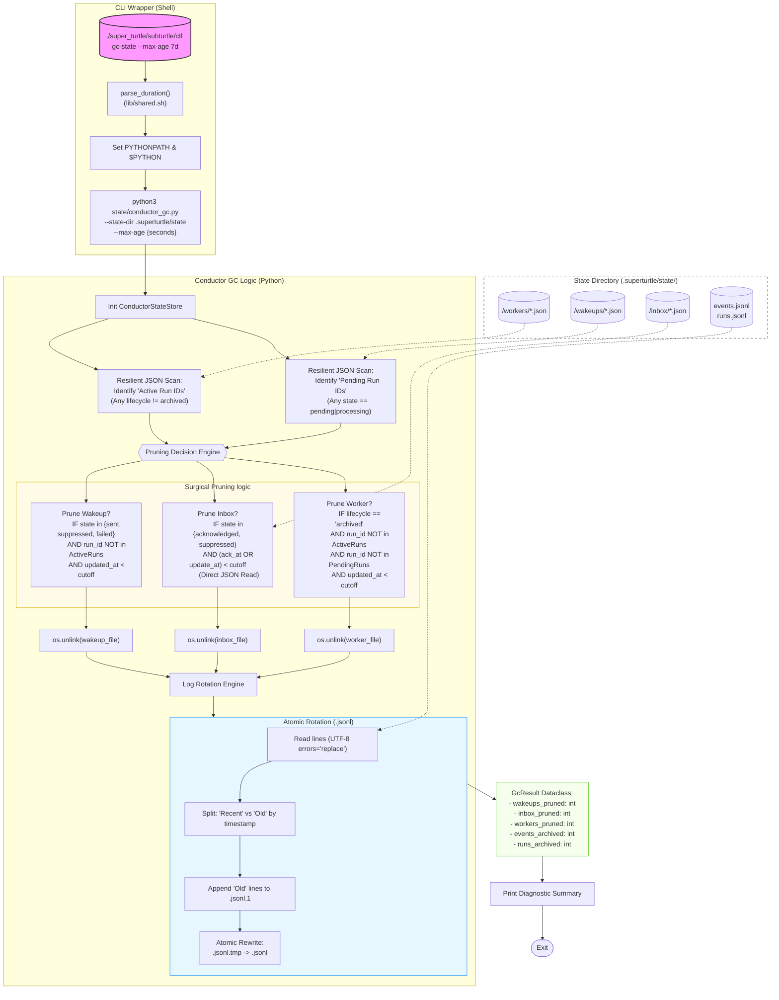

# Conductor GC: Technical Architecture

This diagram illustrates the complete flow of the `ctl gc-state` command, from the CLI entry point to the safety-guarded pruning of workers, wakeups, inbox items, and log rotation.

### Safety Summary
*   **Active Run Guard**: Prevents pruning wakeups/workers for any run that isn't fully archived (protects `running`, `completed`, `failed`, `stopped`, etc).
*   **Pending Wakeup Guard**: Prevents pruning worker state if there are still undelivered (`pending` or `processing`) notifications in the pipe for that run.
*   **Atomic Log Guard**: Uses temporary files and `os.replace` (atomic rename) to ensure log integrity even on sudden process interruption.
*   **Data Resilience**: Uses `errors="replace"` in UTF-8 decoding and resilient JSON scanning to skip corrupt records without crashing.
*   **Inbox Precision**: Prioritizes `delivery.acknowledged_at` for inbox items, ensuring we only prune once a human has actually seen the message.
