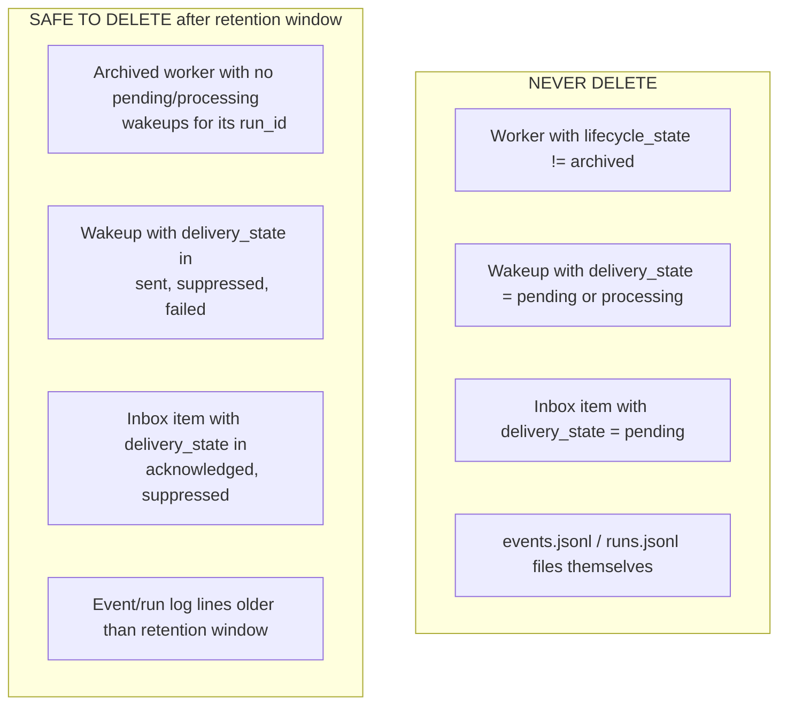
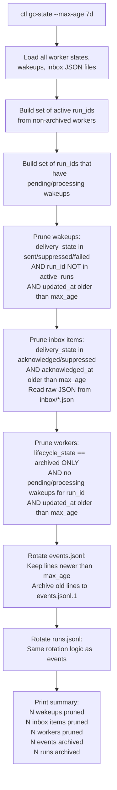
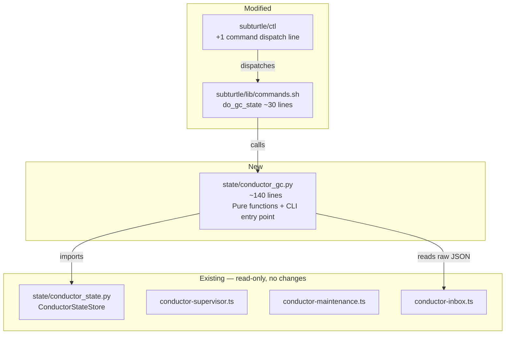
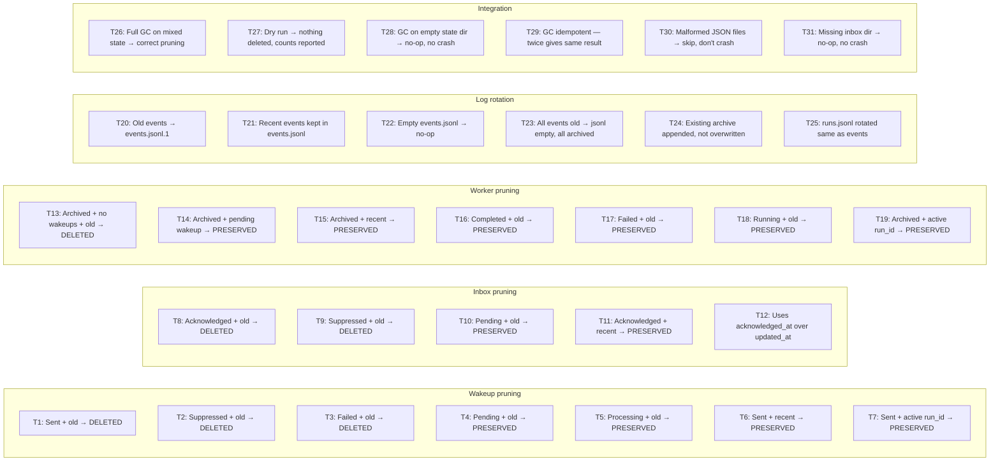
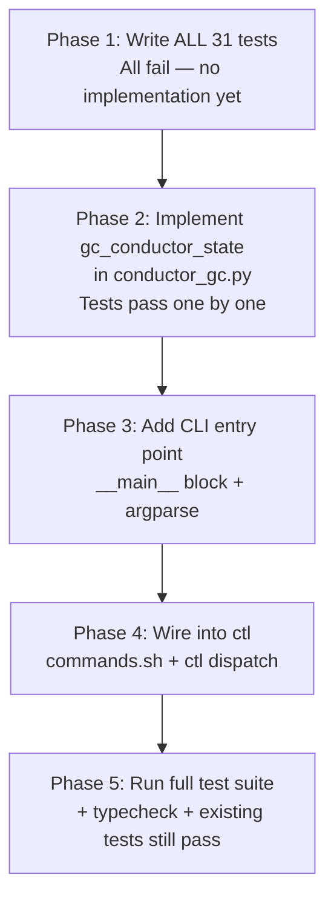

# Conductor State GC — Design & Implementation Plan

## Context

From CLAUDE.md backlog (line 139):
> Add conductor state retention/gc so `.superturtle/state/` does not grow forever: prune old sent wakeups, acknowledged inbox items, stale archived worker records, and rotate/archive `events.jsonl`

**Status:** Zero implementation exists. Confirmed via git history (no commits, no pickaxe hits, no code referencing conductor GC/retention/pruning anywhere in 1,696 commits).

**Precedent:** `ctl gc` already handles workspace cleanup (`commands.sh:843-891`) — archives stale workspace directories based on `--max-age`. Conductor state GC follows the same pattern but targets `.superturtle/state/` instead of `.subturtles/`.

## What Grows Without Bound Today

```
.superturtle/state/
├── workers/        # One JSON per worker. Archived records accumulate forever.
├── wakeups/        # One JSON per wakeup. Sent/suppressed/failed records accumulate.
├── inbox/          # One JSON per inbox item. Acknowledged/suppressed items accumulate.
├── events.jsonl    # Append-only. Every lifecycle event ever emitted. Never rotated.
└── runs.jsonl      # Append-only. Every run record ever written. Never rotated.
```

A project running 5 SubTurtles/day for a month accumulates:
- ~150 worker state files (most archived)
- ~500+ wakeup records (most delivered)
- ~300+ inbox items (most acknowledged)
- ~5,000+ lines in events.jsonl (~2MB+)
- ~150+ lines in runs.jsonl

None of this is cleaned up. Ever.

## Scope — Exactly What the Backlog Says

The CLAUDE.md backlog item specifies four targets:

| Target | Backlog wording | What we prune |
|--------|----------------|---------------|
| Wakeups | "old sent wakeups" | `delivery_state` in `{sent, suppressed, failed}` older than retention window |
| Inbox | "acknowledged inbox items" | `delivery_state` in `{acknowledged, suppressed}` older than retention window |
| Workers | "stale **archived** worker records" | `lifecycle_state == "archived"` only — not other terminal states |
| Events | "rotate/archive `events.jsonl`" | Move old lines to `events.jsonl.1`, keep recent lines |
| Runs | *(implicit — same append-only pattern)* | Rotate `runs.jsonl` same as events |

**Important:** The backlog says "stale archived worker records", not "all terminal workers". Workers in `completed`, `failed`, `timed_out`, or `stopped` states are kept — only `archived` workers (which have already been reconciled and explicitly archived by the supervisor) are eligible for GC.

## Safety Constraints

These are hard rules. The GC must never violate them.



### Why these constraints?

| Constraint | Reason | Code reference |
|-----------|--------|----------------|
| Don't delete non-archived workers | Non-archived terminal states (`completed`, `failed`, `stopped`, `timed_out`) may still need supervisor reconciliation | `conductor-supervisor.ts:1026` |
| Don't delete pending/processing wakeups | Bot timer delivers these on 10s cycle; startup recovery replays stranded `processing` wakeups | `conductor-maintenance.ts:119` |
| Don't delete pending inbox items | Next interactive Claude/Codex turn injects these as background context | `conductor-inbox.ts:195` |
| Don't delete events.jsonl/runs.jsonl files | Dashboard detail pages and conductor snapshot read recent events | `conductor-snapshot.ts:143` |
| Protect wakeups matching active run_id | Run-aware filtering skips stale wakeups; deleting active ones breaks delivery | `conductor-supervisor.ts:686` |

## Cross-Module Boundary: Inbox

**Critical design note:** The inbox system is TypeScript-only (`conductor-inbox.ts`). The Python `ConductorStateStore` has no inbox awareness — `ConductorPaths` does not include `inbox_dir`, and `ensure_conductor_state_paths()` does not create it.

The GC handles inbox by reading raw JSON files directly from `state_dir / "inbox" / "*.json"`. Each file is a `MetaAgentInboxItemRecord` with this structure (from `conductor-inbox.ts:22-45`):

```json
{
  "id": "inbox_abc123",
  "delivery_state": "acknowledged",
  "updated_at": "2026-03-10T12:00:00Z",
  "delivery": {
    "acknowledged_at": "2026-03-10T12:05:00Z"
  }
}
```

For age comparison, the GC uses `delivery.acknowledged_at` when available (most precise — the actual acknowledgment timestamp), falling back to `updated_at`.

## GC Flow



### Ordering matters

Wakeups must be pruned **before** workers. A worker is only safe to prune after all its wakeups are gone or delivered. If we pruned workers first, we'd orphan wakeup records that reference deleted workers.

## Where This Lives in the Code



**Key decisions:**

1. GC lives in Python (`state/conductor_gc.py`) because `ConductorStateStore` is Python — direct import, no subprocess. Follows the pattern of `state/conductor_state.py` and `state/run_state_writer.py`.

2. Inbox pruning reads raw JSON files directly from `inbox/` directory. We do NOT add inbox methods to `ConductorStateStore` — inbox is a TypeScript-owned concept, and the GC only needs to read `delivery_state` and `delivery.acknowledged_at` from the JSON files.

## API

### CLI

```bash
# Prune conductor state older than 7 days (default)
ctl gc-state

# Custom retention
ctl gc-state --max-age 14d

# Dry run — show what would be deleted without deleting
ctl gc-state --dry-run

# Also callable directly
python3 -m super_turtle.state.conductor_gc \
  --state-dir .superturtle/state \
  --max-age 7d
```

### Python

```python
from super_turtle.state.conductor_gc import gc_conductor_state, GcResult

result: GcResult = gc_conductor_state(
    state_dir=Path(".superturtle/state"),
    max_age_seconds=7 * 86400,
    dry_run=False,
)
# result.wakeups_pruned, result.inbox_pruned,
# result.workers_pruned, result.events_archived,
# result.runs_archived
```

## Test Plan (TDD — tests first)

Tests live in `super_turtle/state/test_conductor_gc.py`. Each test creates a temp state directory, populates it with fixture data, runs GC, and asserts what was deleted vs preserved.

### Test matrix



### Test detail: what each test proves

| # | Test | Proves | Safety constraint |
|---|------|--------|-------------------|
| T1-T3 | Terminal wakeups pruned after retention | Sent/suppressed/failed wakeups don't accumulate | — |
| T4-T5 | Pending/processing wakeups preserved | **Never lose undelivered notifications** | Hard rule |
| T6 | Recent sent wakeup preserved | Retention window respected | — |
| T7 | Sent wakeup with active run_id preserved | **Run-aware safety** — don't prune wakeups for workers that might need recovery | Hard rule |
| T8-T9 | Terminal inbox items pruned | Acknowledged/suppressed items don't accumulate | — |
| T10 | Pending inbox preserved | **Never lose uninjected background context** | Hard rule |
| T11 | Recent acknowledged inbox preserved | Retention window respected | — |
| T12 | Acknowledged_at used for age calculation | **Precision** — uses the actual ack time, not the last-write time | Correctness |
| T13 | Archived worker pruned when safe | State files cleaned up after full reconciliation | — |
| T14 | Archived worker with pending wakeup preserved | **Worker stays until all wakeups delivered** | Hard rule |
| T15 | Recent archived worker preserved | Retention window respected | — |
| T16-T17 | Completed/failed worker preserved | **Only archived workers are GC'd** per backlog spec | Hard rule |
| T18 | Running worker preserved | **Never delete active worker state** | Hard rule |
| T19 | Archived worker with active run_id match preserved | Edge case: reused worker name | Hard rule |
| T20-T25 | Log rotation | Rotated without data loss, archive append semantics, both files | — |
| T26-T31 | Integration | End-to-end correctness, idempotency, resilience, missing dirs | All |

## Implementation Order



### Phase 1 — Tests (all fail)

Create `super_turtle/state/tests/test_conductor_gc.py` with 31 tests. Each test:
1. Creates a temp directory via `tmp_path` fixture
2. Uses `ConductorStateStore` to populate worker/wakeup state files with known data
3. Writes inbox JSON files directly (since ConductorStateStore has no inbox methods)
4. Calls `gc_conductor_state()` with specific `max_age_seconds`
5. Asserts files exist or don't exist

### Phase 2 — Implementation

Create `super_turtle/state/conductor_gc.py`:

```python
@dataclass
class GcResult:
    wakeups_pruned: int
    inbox_pruned: int
    workers_pruned: int
    events_archived: int
    runs_archived: int
    dry_run: bool

def gc_conductor_state(
    state_dir: Path,
    max_age_seconds: int = 7 * 86400,
    dry_run: bool = False,
) -> GcResult:
    ...
```

Functions:
- `_prune_wakeups(store, cutoff_iso, active_run_ids, dry_run) -> int`
- `_prune_inbox(inbox_dir, cutoff_iso, dry_run) -> int` — reads raw JSON, no ConductorStateStore
- `_prune_workers(store, cutoff_iso, active_run_ids, pending_wakeup_run_ids, dry_run) -> int` — archived only
- `_rotate_jsonl(jsonl_path, cutoff_iso, dry_run) -> int` — shared for events.jsonl and runs.jsonl

Each is a pure function operating on the state directory. No network, no subprocesses, no side effects beyond file deletion.

### Phase 3 — CLI entry point

Add `if __name__ == "__main__"` block with argparse: `--state-dir`, `--max-age`, `--dry-run`.

### Phase 4 — Wire into ctl

Add `gc-state` command to `ctl` dispatch and `do_gc_state()` to `commands.sh` (thin wrapper that calls Python, same pattern as existing conductor shell functions).

### Phase 5 — Verification

- All 31 new tests pass
- Existing `test_conductor_state.py` still passes
- `bun run typecheck` passes (no TS changes, but verify)
- `bun test` passes (no TS test changes)

## What This Does NOT Touch

- No TypeScript changes (all consumers are read-only; they handle missing files gracefully)
- No changes to `ConductorStateStore` (GC uses existing read/list methods + direct file deletion for workers/wakeups, raw JSON reads for inbox)
- No changes to conductor-supervisor, conductor-maintenance, or conductor-inbox
- No changes to dashboard, handoff rendering, or snapshot logic
- No changes to the bot timer or cron system
- No changes to agent prompts or loop runner

## Configuration

| Parameter | Default | CLI flag | Meaning |
|-----------|---------|----------|---------|
| `max_age_seconds` | 604800 (7 days) | `--max-age 7d` | Records older than this are eligible for pruning |
| `dry_run` | False | `--dry-run` | Print what would be deleted, delete nothing |

## File Summary

| File | Action | Lines |
|------|--------|-------|
| `state/conductor_gc.py` | **NEW** | ~140 |
| `state/tests/test_conductor_gc.py` | **NEW** | ~450 |
| `subturtle/ctl` | **MODIFY** | +1 line (dispatch) |
| `subturtle/lib/commands.sh` | **MODIFY** | +30 lines (`do_gc_state`) |

Total: ~620 lines, of which ~450 are tests.
